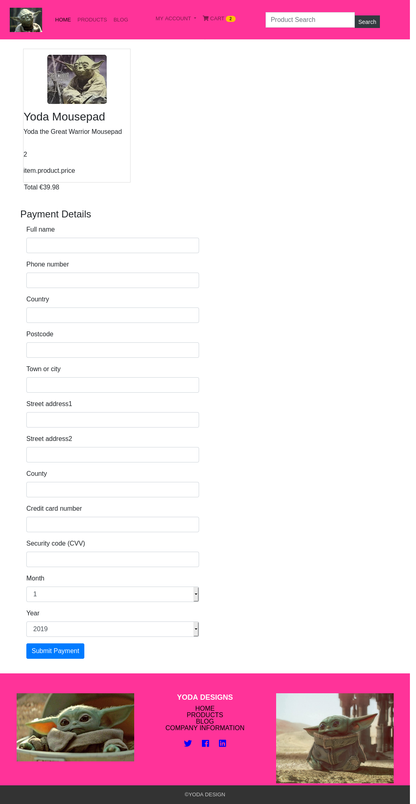

<h6>Deirdre Weldon</h6>

<h1>Full Stack Framework Milestone - An ecommerce project using Django and Python</h1>

[View Project](https://yoda-design.herokuapp.com/)

## **Purpose of Project**
This project is my 4th Milestone Project for Full-Stack Diploma in Software Development. It is a Django Project and the final project for completion of this course. The project uses Python3.6, Django, HTML5, CSS3, Boostrap forms, Bootstrap 4.3.1, Javascript, SQLite3, Postgress DB and Heroku platform for deployment. The purpose of this project is create an Ecommerce project for a  design start-up (Yoda Design) where users can view a products and suggest their own ideas under a designated 'ideas' tab on the navbar. Furthermore users have complete control of their transactions from adding items to cart to checkout and amending items. In addition, users can vote up or down their favorite ideas and popular ideas will be implemented in future versions of the e-commerce store, subject to sales performance.

## **UX Design**

[

[

The initial idea of creating DumpDinners website originated from my interest in designer made products and as one of the ideas for this project was a design theme. Furthermore my fascination of Yoda in Star Wars and its popularity inspired me to develop an Ecommerce app with a design theme -[StarWars Website](https://www.starwars.com/databank/yoda).

### - Blob Images
[Image of Products Page](https://github.com/Deirdre18/yoda-design-ecommerce-app-Milestone4-project/blob/master/UX%20Design/Products%20Page.png)

[Image of Checkout Mobile View Page](https://github.com/Deirdre18/yoda-design-ecommerce-app-Milestone4-project/blob/master/UX%20Design/checkout_page.png)

**User and User Stories**
First and foremost, the user is the primary focus of creating any website. The type of user I would expect to view Yoda Design e-commerce app would be as follows:-

- Someone who loves Star Wars.
- Someone interested in the character of Yoda and Baby Yoda.
- Someone who follows the trilogies and is an advant fan of Star Wars.
- A child, teenager, adult.
- Student (studying science, space, coding, film, science fantasy).
- Anyone interested in space frontier fantasy movies and characters.
- Anyone interested, in particular, with the 'force' and magic.
- Anyone who likes designer products.
- Anyone interested in supernatural phenomena.
- Anyone interested in purchasing from an e-commerce online store.

From researching what a user story is, I delved more into the background of StarWars, which is about aliens, space battles, ghosts and mystical power - akin to Harry Potter fantasy, only orchestrated in space. As fantasy exists in the imagination, it paves the way for actual real scientific technological advances in the future (ie) scientists have begun to create miniature lightsaber-like devices. The 'Force' is what makes StarWars fantasy, combined with the green energy fields which surround Jedi and seem magical. The Force acts like magic and magical things happen. StarWars and the characters put a dichotomy on dark forces, attachments and have a rule based hierarchy in the Kingdom. I referred to this websites for research - [Deciphering StarWars:Sci-Fi or Fantasy?](https://www.liveabout.com/star-wars-sci-fi-or-fantasy-2958030) and to research the line of products labelled 'Baby Yoda', I looked at this [Baby Yoda](https://www.cnet.com/news/who-or-what-is-baby-yoda-in-the-mandalorian-our-wildest-theories-so-far/).Baby Yoda is cute and adorable and a funky pop icon.

The user story above describes the type of user, what they want and why. A user story helps to create a simplified description of a requirement." - [What is a User Story?](https://searchsoftwarequality.techtarget.com/definition/user-story).

As per previous projects I completed, for direction in UX design I referred to what I learned in the Code Institute tutorials, and also referred to this website about user experience, [Red Rocket Web Specialist](https://www.redrocketmg.com/5-planes-UX-design-great-website/), who consider that the two most important aspects of designing a good website are (1) the Abstract aspect (idea, goal, etc) and (2) the Concrete aspect (how to get a user to click on a link, etc). The transition from Abstract to Concrete should remain linear to ensure a smooth transition, with each phase being fluid and overlapping.

***GARRET'S FIVE PLANS OF UX DESIGN:-***

### - Strategy (The goal)
The strategy is concerned with the goal of the project, which is to create a user friendly, easily navigational, interactive e-commerce app for Yoda designer products. As a user I wish to interact with the app, by being able to view, login, register, logout, view blog posts (but not add one), add products to shopping cart, delete and amend products, checkout and pay with credit/debit card, suggest ideas and vote up/down for ideas. CRUD functions are demonstratable throughout the project.

### - Scope (What tasks can be done)
The tasks that can be accomplished on Yoda Design e-commerce app involve all CRUD functions - therefore the user will be able to interact as stated above. CRUD is an acrynom standing for (create, read, update and delete) - [What is CRUD?](https://www.codecademy.com/articles/what-is-crud). The website uses Django, which is Django is a high-level Python Web framework that is fast, powerful and security focused built by developers for developers, in addition to being free and open source. As much code is reused and refactored it makes web app development speedier.

### - Structure (Plan or Flow of Interactions)

This is the plan or flow of interactions users will take to navigate and understand Yoda Design e-commerce website. I considered my database structure and detail below in the **database** section, the schemata of models used for the DumpDinners website.

### - Skeleton

In this section, I tried to place the elements in appropriate places, and in a logical order – such as navbar, body with products then individual pages such as login, register, logout, profile, blog posts, cart, checkout and ideas. The website made good logic and was easy to navigate, and each page contains a search button. I took screenshots of the various views, which are inclued in this README.

### - Surface

The surface, or the skin – is the interface for which visitors will engage with the dashboard. I kept the color scheme congruent, using vibrant and zazzy colors (dark pink for navbar and footer and lighter shade of pink for background, so the website was a mixture of pink and white with shades of grey (grey button, etc) throughout. The colours were complimentary. I felt the color scheme was congruent and created a good look and feel and that it was appropriate to a designer themed e-commerce website.

## **Features Overview**

## **Existing Features**

- Congruent Color Scheme (Pink and White and shades of grey) with white highlighting.
- User login and register features. Messages sent for successful login and registering.
- Routing to relevant pages by clicking on navbar links.
- Adding ideas feature and up/down voting of ideas, adding items to shopping card, checking-out (users must be logged in for this feature), amending order items, viewing profile (which welcomes user and shows their details).
- Website and images are responsive across all mobile devices, as detailed under **Testing** section below.
- Search bar to search for recipes using keyword or full product name.
- I added a favicon feature - [Favicon](https://www.flaticon.com/)
- Users can 'Vote up/down' a new product idea they themselves or others added.
- Throughout the website there are links to home/index page which is the products page.
- Users can connect to social media by clicking on links in footer.

## **Features left out which could be implemented in future versions**

- Search functionality could be expanded to include the first 3 characters of a product when users search.
- A share on social media button could be added.
- An incremental chart/user dashboard of votes (ascending and descending) could be implemented to show which features are most popular.
- More products could be added and pagination used or 'more' button to view all products.

## **Testing**

### - General Testing
After some time testing both debug and alternating deployment in production mode, I was able to understand how static files worked in both modes. In production mode, debug should be off for security reasons, however this then can cause conflict with displaying static and media files. As I installed Whitenoise, I added ''whitenoise.runserver_nostatic'in my installed apps in settings.py. I refered to [Whitenoise]("http://whitenoise.evans.io/en/stable/django.html"). This meant that static file handling was taken over by Whitenoise instead of Django and so I could view static files in production mode locally. However when I deployed to Heroku, an error occurred saying that I should add DISABLE_COLLECTATIC=1 into config variables in Heroku, which I did.  

On further testing I worked out a way to test in debug mode, whilst commenting out STATIC_ROOT = os.path.join(BASE_DIR, 'static') in base.html file, and uncommenting it when deploying to Heroku. In this way I can test in debug mode and view all static and media files and deploy to Heroku confident that static/media files will be displayed in production mode.

### - Testing Functionality

- Wrong password -

- Wrong or non-existent Username -

- Logged Out -

- Registered -

- Login -

- Search -

### - Django Built-in Tests

I tested products by running 'python3 manage.py test products', which successfully passed.

<table>
    <tr>
        <th>PRODUCTS APP</th>
    </tr>
    <tr>
        <td>1 Test</td>
    </tr>
</table>

### - Travis Testing

Travis Continuous Integration has been passing tests since I first started this project. The Travis link is at the top of README. I have found it very useful in aligning integrated testing with development.

### - Manual testing

Manually tested login, register, add products to cart, view blogs, profile and login status, search bar.

### - Developer tools testing

Used Chrome and Firefox developer tools to view app in responsive mode and debug throughout developing this project. I tested this project on iPhone 6/7/8, Galaxy S9/S9+, iPad, iPhone 6/7/8 Plus, iPhone X/XS, Kindle Fire HDX and on medium and large screen sizes.

### - Testing STRIPE

Tested STRIP payments on checkout using testing card 42424242424242 CVV 111 (or any 3 digits). This worked and got message saying "You have successfully paid". On trying other varients of testing card number I got some interesting messages. Instead of inputting the 16 digit test card number, if I put in the same numbers but had 19 digits, I got no messages displayed but got email from STRIPE saying that the charging  API used for testing purposes doesn't cover SCA (strong customer authentication) and as such testing doesn't support SCA or 2-factor authentication. The STRIPE developers website is here [STRIPE FOR DEVELOPERS]- (https://stripe.dev/)

## **Databse schema**:

### Results from Postgress Database Schema Explorer in heroku

**products_prodct**                 **auth_user**
description     text                date_joined      timestamptz
id              int4                email            varchar
image           varchar             first_name       varchar
name            varchar             id               int4
price           numeric             is_active        bool
                                    is_staff         bool
                                    is_superuser     bool
                                    last_login       timestamptz
                                    last_name        varchar
                                    password         varchar
                                    username         varchar

**django_admin_log**                  **django_session**
action_flag           int2            expire_date   timestamptz
action_time           timestamptz     session_data  text
change_message        text            session_key   varchar
content_type_id       int4
id                    int4
object_id             text
object_repr           varchar
user_id               int4

**checkout_order**                    **posts**
country               varchar         content           text
county                varchar         created_date      timestamptz
date                  date            id                int4
full_name             varchar         order_id          int4
id                    int4            product_id        int4
phone_number          varchar         quantity          int4
postcode              varchar
street_address        1varchar
street_address        2varchar
town_or_city          varchar

**checkout_orderlineitem**
id                int4
image             varchar
published_date    timestamptz
tag               varchar
title             varchar
views             int4

### **Technologies used includes:**
- **HTML5**, **CSS3**, **Javascript**, **JQuery**, **Bootstrap**, **Python**, **Django**

Base languages used to create website.

Used **HTML5** to handle page routing and to build custom directives - [HTML5](https://www.html5rocks.com/en/)

Used **Font Awesome** icons to give our project an intuitive 'google style'look and feel - [FONT AWESOME 4.7.0](https://fontawesome.com/v4.7.0/)

Used **CSS3** for styling and enhancing the look of the website - [CSS3](https://developer.mozilla.org/en-US/docs/Web/CSS/CSS3)

Used **Javascript** (minified versions) added end of document - [JAVASCRIPT](https://developer.mozilla.org/bm/docs/Web/JavaScript)

Used **JQuery** to trigger STRIP at checkout of shopping cart - [JQUERY](https://jquery.com/)

Used **Bootstrap 4.3.1** to add styling to forms and to the e-commerce app generally - [BOOTSTRAP](https://stackpath.bootstrapcdn.com/bootstrap/)

Used **Python 3.6.9** in a virtual environment for developing this project - [PYTHON](https://docs.python.org/3/)

Used **Django 11.1.23** for developing this project - [FLASK]([Django](https://www.djangoproject.com/))

Used **Postgress Database** which was added on Heroku dashboard - [PostgresSQL Database](https://www.postgresql.org/)

Used **SQLite3 Database** initially when developing the project and later reverted to PostgresSQL - [SQLite3](https://www.sqlite.org/version3.html)

## **Version Control (GitHub)**

I continuously pushed to GitHub with useful comments in every commit. It was therefore easier to track back to any problems.

## **Deployment**

I deployed this project to Heroku Platform - I used Heroku to deploy my project [Heroku](https://dashboard.heroku.com), which is a free cloud based platform. I provisioned PosgressSQL add-on (free hobby version) on Heroku. I connected my deployment to GitHub, so that whenever I pushed to GitHub, the deployed app was also updated to the current version. In Heroku, I configured variables, such as SECRET_KEY, STRIPE_PUBLISHABLE, STRIPE_SECRET, DISABLE_COLLECTSTATIC=1, DJ_DATABASE_URL.

This project is developed on Heroku Platform - [Yoda Design](https://yoda-design.herokuapp.com/)

## **How I developed this project and how to run the code for this project**

I developed this project using Atom text editor, which worked very well and had minimal issues. I firstly went through videos to learn Django from Code Institute, putting it all together and creating a 'BlogAllAboutIt app'. From there I was able to use this as a basis to create and development this project. I did not use AWS or Cloud9, however some files in the 'suggestions' folder are named using C9. The reason for this being that I directly copied this particular folder (called 'Suggestions') from a fellow student into my project to resuse the code he wrote, in order to save time, as the deadline for submission was fastly approaching. I have given credit to [Lucas Suarez](https://github.com/Code-Institute-Submissions/django-tech-ecommerce-app/blob/master/README.md) for his award winning project which was featured in Code Institute's Code Insider's newsletter.

The steps I took to develop this project are as follows:--
**Please note that the project was originally created from the Code Institute tutorials and renamed to 'Yoda Design'.** Further design and development was done to the basic structure of the project, as outlined in this README.

**The steps I took to create this project and how to run this project.**
*NOTE THAT I REUSED THE 'ACCOUNTS' APP CREATED FROM INITIAL TUTORIAL*

1)  mkdir ~/e-commerce
2)  cd ./e-commerce
3)  virtualenv .venv_django --python=$HOME/.pyenv/versions/3.6.9/bin/python
4)  source .venv_django/bin/activate
5)  django-admin startproject ecommerce
6)  freeze > requirements.txt
7)  python3 manage.py makemigrations
8)  python3 manage.py migrate
9)  echo -e "*.sqlite3\n*.pyc\n_pycache_/"> .gitignore
10) add env.py file to add secret_keys, etc and put into .gitignore
11) git init, git add, git commit -m"initial commit"
12) git remote add orign [remote], git push -u origin master
13) git commit -m"synching repo with travis"
14) python3 manage.py startapp home
15) python3 manage.py startapp products
16) pip3 install Pillow
17) python3 manage.py makemigrations products
18) python3 manage.py migrate products
19) python3 manage.py test products
20) pip3 install django-forms-bootstrap
21) pip3 install whitenoise
22) manage.py startapp cart
23) python3 manage.py startapp search
24) pip3 install stripe
25) python3 manage.py startapp home
26) python3 manage.py startapp checkout
27) python3 manage.py makemigrations checkout
28) python3 manage.py migrate checkout
29) pip3 install dj-database-url
30) pip3 install psycopg2
31) python3 manage.py collectstatic (if AWS S3 bucket used)
32) pip3 install gunicorn
33) add Procfile to instruct heroku that Django and Python are to be used
34) to use postgress db, add it in heroku dashboard and update code.

**NB: the above code can be run using 'python3 manage.py runserve'. If deploying for product please make sure debug=false and when testing turn debug=true and uncomment line 128 in settings.py file. In addition for every installation update requirements.txt (pip3 freeze > requirements.txt). After creating new apps (home, search, products, posts, etc) always do python3 manage.py make migrations and python3 manage.py migrate.**

## **Difficulties I came across**

I encountered difficulty using STRIPE at one point, as I had changed base.html file and moved jquery script to bottom of page, which is where it usually goes. However for STRIPE to work and a payment to be accepted (using testing card 4242 4242 4242 4242 and CVV, which can be any three digits) - jquery needs to go at the top of base.html file. I used firefox developer tools to debug and saw a jquery reference error relating to this.

## **Credits/Acknowledgement**

I give credit to fellow student (Lucas Suarez), particularly for using the 'suggestions'(ideas) code, which was directly copied into my project from his GitHub repository. I reused all the 'suggestions' code and added an 'ideas' link in my navbar - [Django-tech-ecommerce](https://github.com/Code-Institute-Submissions/django-tech-ecommerce-app).

I also give credit to fellow student (Deborah Thompson) for general support and some guidance, and for looking at her project to get a good sense of layout for some pages (ie) profile page - [Maths Revision](Maths Revision](https://github.com/debbiect246/mathsplusrevision)

I also give credit to Code Institute for their solutions on GitHub, which helped me get this project off the ground - [GitHubSolutions](https://github.com/Code-Institute-Submissions/django-tech-ecommerce-app)

I also give thanks to my fellow students on Slack Community who were very supportive - [Slack](https://slack.com/intl/en-ie/)

## **Content**

The content contained in this project is my own and anywhere I've used any outside references, I've made full reference to all sources of research material used.

## **Code**

- I based the project on code I learned throughout the course from the tutorial videos and mini projects of [Code Institute](https://www.codeinstitute.net/) and by referring to the lessons.

- I have given full credit for all sources of code used from other, as well as from Code Institute in the above section **Credits/Acknowledgements**, and by commenting credit throughout the code.

- As I had developed a good understanding of security and importance of hiding secret_key's, publishable keys, etc, I created an env.py file was was added to .gitignore. I added secret_key's also in configuration variables on Heroku.

For help with making jumbotron responsive across different sized devices, I referred to this [Jumbotron Responsiveness](https://stackoverflow.com/questions/29592302/bootstrap-responsive-jumbotron/50710437)

I also referred to [W3Schools](https://www.w3schools.com/) and also on occasion I referred to [Stack Overflow](https://stackoverflow.com/).

## **References**

I referred to the following websites for project images:-

[Yoda Mousepad](https://www.amazon.com/Abystyle-STAR-WARS-Mousepad-Yoda/dp/B01BFGCJ38)

[Mandalorian products](https://money.com/baby-yoda-toys-t-shirt-mandalorian-disney-plus/)

[Baby Yoda Dolls](https://www.eonline.com/news/1099401/baby-yoda-dolls-are-here-but-there-s-a-catch)

[Yoda Lego set](https://www.lego.com/en-us/kids/sets/star-wars/yoda-495867f9321e4189a2e241fc88bafd3e)

[Yoda gifts on Amazon](https://www.amazon.com/slp/yoda-gifts/7hw5autakufk8oo)

[StarWars Products](https://www.liveabout.com/yoda-in-star-wars-2957947)

## Licence
Copyright (c) Deirdre Weldon

Written with [StackEdit](https://stackedit.io/)
